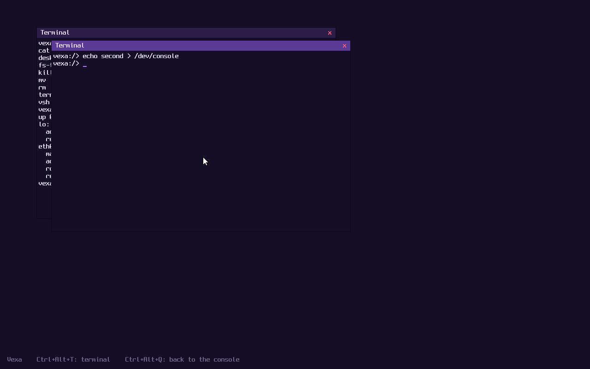

# Vexa

Vexa is a hobby operating system for x86_64, written from scratch in C.
The long-term goal is to run **Mozilla Firefox**.

Vexa has its own kernel design, its own system call interface and its own C library.
Linux programs such as Firefox run through a separate, optional compatibility subsystem
that sits on top of the Vexa kernel. See [docs/ARCHITECTURE.md](docs/ARCHITECTURE.md).




## Status

Phases 1 to 7 are complete: boot and CPU basics, memory management, processes and
user mode, files and storage, a userland, threads and dynamic linking, and networking.
Vexa boots into its own shell, `vsh`, with a set of native programs, and runs Linux
programs (BusyBox, GNU bash and coreutils, Python 3.12) through the Linux subsystem.
Phase 8, graphics, is under way: Vexa has its own desktop with terminal windows, and
runs X programs such as `xterm` in windows of their own on it. The kernel:

- boots through the [Limine](https://github.com/limine-bootloader/limine) bootloader (BIOS and UEFI)
- runs in 64-bit long mode as a higher-half kernel
- shows a text console on the screen (with ANSI colors and cursor movement) and mirrors
  it to the COM1 serial port
- loads its own GDT and IDT and reports CPU exceptions with a register dump
- reads the ACPI tables and sets up the local APIC and I/O APIC, falling back to
  the legacy 8259 PIC on machines without them
- runs a 1000 Hz timer: the local APIC timer calibrated against the PIT, or the PIT
  itself
- manages memory with a buddy page allocator, its own page tables (read-only code,
  no-execute data) and a slab-based kernel heap (`kmalloc`/`kfree`)
- gives programs memory on demand, and shares pages copy-on-write
- runs on kernel stacks with guard pages, and reports stack overflows and other faults
  in plain words
- reads the PS/2 keyboard (US layout, Shift, Caps Lock, Ctrl) and mouse (with a scroll
  wheel), as input events programs can read
- has a graphical desktop: a compositor that draws programs' windows (shared buffers)
  on the screen, with a panel (the Vexa menu, a button per window, a clock), desktop
  icons, notifications, windows you move, resize, maximize, minimize and snap to an
  edge, and its own apps: a terminal, Files, a text editor, an image viewer (PNG, BMP,
  PPM) and Settings (wallpaper, clock, time zone); the default wallpaper is
  `/share/pictures/meadow.png`
- keeps its desktop apps as bundles, as macOS does: `/apps/Files.vxapp` is a folder
  with the program, its icon and an `Info.conf` saying what it is and which files it
  opens; the menu, the desktop icons, Files and `open` all work from them, and
  copying a `.vxapp` into `/apps` installs it (the desktop notices)
- manages files like Finder: copy, cut and paste (Ctrl+C, X, V), rename (F2), New
  Folder, Move to Trash (`/Trash`, Delete) and Empty Trash, Get Info (Ctrl+I, with
  folder sizes and an app's details), Show Package Contents, Ctrl+L to type a
  location, Ctrl+H for hidden files; right-click menus in Files and on the desktop
- runs the X Window System through the Linux subsystem: Xvexa, an X server (X.Org's,
  built with musl) that shows each X window as a desktop window of its own, with
  TrueType fonts (FreeType, fontconfig, Xft and DejaVu), `xterm`, and GTK 3 programs
  (GLib, cairo, Pango and HarfBuzz, gdk-pixbuf): `gtk3-demo` is in the Vexa menu
- has a terminal with line editing, Ctrl-C (or Ctrl-\\) to stop programs and Ctrl-D for
  end of input
- runs threads with a preemptive scheduler, on every CPU core it finds; a program can
  have many threads, which synchronize by waiting on memory addresses (futexes)
- runs programs in user mode, each in its own address space, and stops a program
  that misbehaves without taking the system down
- has processes with parents and children, process groups, pipes and signals
- saves and restores each program's floating point and vector registers (SSE, AVX)
- has its own system call interface and C library, `libvexa`
- has a file system tree with a root in memory (unpacked from an initramfs), `/dev`,
  and disks mounted under `/mnt`
- drives disks through virtio-blk (virtual machines), AHCI (SATA disks and CD/DVD
  drives) and NVMe, reads GPT and MBR partition tables, reads and writes ext2 file
  systems, and reads CDs (ISO 9660 with Rock Ridge): the Linux programs and libraries
  are read from the boot CD when they're used, not loaded into memory at boot
- has symbolic links, `#!` scripts, and `/proc` (in Linux's format, so `ps` and `top`
  work)
- is on the network: a virtio-net driver, its own TCP/IP stack (Ethernet, ARP, IPv4,
  ICMP, UDP, TCP) with a DHCP client and a loopback interface, and sockets for both
  kinds of programs, including local (Unix domain) sockets that can pass open files
  between processes
- runs Linux programs through an optional Linux subsystem, static or dynamically linked
  (with musl's loader): `fork`, `execve`, signal handlers, terminal control and about
  190 system calls in all. Linux programs find their files under `/linux` first.

At boot, `vinit` (the first program) starts `vsh`, the Vexa shell. Some things to try at
the `vexa:/>` prompt:

| Command | What it does |
| --- | --- |
| `hello` | says hi, and which version of Vexa is running |
| `help` | how to use the shell; `ls /bin` lists the programs |
| `ls /`, `cat /etc/motd`, `cd /tmp`, `pwd` | look around the file system |
| `echo hi > note.txt`, `mkdir`, `cp`, `mv`, `rm -r` | make, copy, move and remove files |
| `ls /bin \| cat`, `cat < note.txt`, `echo more >> note.txt` | pipes and redirection |
| `hello-world` | the first Vexa program |
| `crash` | a program that misbehaves on purpose, to show it gets stopped |
| `fs-test` | checks the file system calls |
| `fpu-stress &` | runs a program in the background (try it three times, then `ps`) |
| `sleep 30`, then Ctrl-C | stops the program in front |
| `ps`, `kill`, `uptime` | processes and how long the system has been up |
| `thread-test`, `pthread-test` | threads: a Vexa program, and a Linux one using musl's pthreads |
| `sys` | the kernel's own commands: `sys disks`, `sys mount`, `sys pci`, `sys cpu`, `sys mem`, `sys memtest`, `sys threads` |
| `bash` | GNU bash, a Linux program (`exit` to go back); inside it, `ls`, `vi`, `grep`, `ps`, `top`... are BusyBox's |
| `sh`, `busybox` | BusyBox's shell; `busybox` alone lists its commands |
| `ln -s`, `cat /proc/meminfo` | symbolic links; `/proc` |
| `desktop` | the graphical desktop, with a terminal window; the Vexa menu (top left) and the icons on the left start programs, Alt+Tab switches windows, dragging a window to an edge snaps it, Ctrl+Alt+T opens a terminal, Ctrl+Alt+F Files, Ctrl+Alt+E the text editor, Ctrl+Alt+X an `xterm` (an X program), Ctrl+Alt+Q goes back to the text console |
| `files`, `edit <file>`, `view <image>`, `settings` | the desktop's apps, from its terminal: `view /share/pictures/aurora.png`; in Files, a right click shows what you can do (copy, rename, Get Info, Move to Trash...) |
| `open <file>`, `open -a <app>` | opens a file with its app, a folder in Files, or starts an app, like macOS's `open`: `open /share/pictures/aurora.png`, `open -a Editor notes.txt` |
| `notify <text>` | a notification on the desktop |
| `input` | the keyboard and mouse; `input watch 1` shows what the mouse reports |
| `net` | network interfaces and addresses (Linux: `ifconfig`, `route -n`) |
| `fetch http://example.com/` | downloads a web page (a Vexa program); `wget` is BusyBox's |
| `socket-test`, `bsd-socket-test` | checks sockets: a Vexa program and a Linux one |

The kernel's built-in command line (the kernel monitor) is still there for when
something is broken: pick it in the boot menu, and Vexa starts it instead of `vinit`.

If Vexa has trouble on a machine, pick **safe mode** in the boot menu. It ignores ACPI
and uses only the oldest, most widely supported interrupt and timer hardware. The
kernel options behind it (`acpi=off`, `noapic`) can also be set in `limine.conf`, as can
`nosmp` to use only the first CPU core.

### Network

`make run` gives Vexa a virtio network card behind QEMU's user-mode NAT: DHCP hands out
10.0.2.15, the router is 10.0.2.2 (which is also your machine), and DNS goes through
10.0.2.3. Try `net`, `fetch http://example.com/`, or `wget -O - http://example.com/`.
There is no HTTPS yet (no TLS library), and no IPv6.

### Disks

Vexa mounts every ext2 file system and CD it finds at `/mnt/<disk>`, such as `/mnt/vda1`
or `/mnt/cd0` (the boot CD is also `/cdrom`). The easiest way to try it is `make run-disk`: it boots with a small
disk (kept in `build/my-disk.img`, so what you write survives restarts). To prepare
your own disk image on Linux:

```sh
truncate -s 64M disk.img && mke2fs -t ext2 disk.img
qemu-system-x86_64 -M q35 -m 512M -cdrom build/vexa.iso -boot d \
    -drive file=disk.img,if=virtio,format=raw
```

ext4 disks are refused (Vexa doesn't support their extra features yet), and ext2 has no
journal, so pulling the plug mid-write can leave the disk needing a check with
`e2fsck` on Linux.

Phase 8 is under way: Vexa has a graphical desktop of its own (`desktop`), with terminal
windows you can drag, resize, maximize and minimize, and X programs run on it as windows
of their own: Ctrl+Alt+X opens an `xterm`.
Next: the Linux display and input interfaces (DRM "dumb buffers", evdev), so that Linux
graphics programs can also run without X. See [docs/ROADMAP.md](docs/ROADMAP.md) for the
full plan from here to Firefox.

## Download

Every push to the default branch is built and boot-tested by GitHub Actions, then
published on the [Releases page](https://github.com/EnderiumCraft/Vexa/releases):

- **[Latest build](https://github.com/EnderiumCraft/Vexa/releases/tag/latest-build)**:
  the newest ISO, replaced on every push
- **Versioned releases** (`v0.1.1`, ...): created whenever `VEXA_VERSION` in
  `kernel/include/vexa/version.h` changes, and kept permanently

Run a downloaded ISO with `qemu-system-x86_64 -M q35 -m 512M -cdrom vexa-<version>.iso`.

## Building

You need a Linux host (or WSL) with:

| Tool | Debian/Ubuntu package |
| --- | --- |
| GCC or Clang targeting x86_64 | `build-essential` |
| GNU ld | `binutils` |
| xorriso | `xorriso` |
| QEMU | `qemu-system-x86` |
| git, make | `git`, `make` |
| Python 3 (for `make test`) | `python3` |
| UEFI firmware (for `make test`) | `ovmf` |
| mke2fs and e2fsck (for test disks) | `e2fsprogs` |
| musl C compiler and Linux headers (for BusyBox and bash) | `musl-tools`, `linux-libc-dev` |
| curl (downloads bash's source once) | `curl` |
| Meson, Ninja, pkg-config, bison and gperf (for X) | `meson`, `ninja-build`, `pkg-config`, `bison`, `gperf` |
| GLib's code generators (for GTK) | `libglib2.0-dev-bin`, `gtk-update-icon-cache` |

```sh
make                # builds build/vexa.iso (fetches Limine on first run)
make run            # boots in QEMU; kernel log appears in your terminal
make LINUX_COMPAT=0 # a kernel without the Linux subsystem (and without /linux)
make run-disk       # the same, with a disk mounted at /mnt/vda1
make run-nographic  # headless boot, serial only (Ctrl-A then X to quit)
make test           # boots in QEMU (BIOS; UEFI with 4 CPUs and 6 GiB; safe mode), with
                    # virtio, SATA and NVMe test disks; types commands into the virtual
                    # keyboard, checks the replies, then checks the disks with e2fsck;
                    # then boots a kernel built without the Linux subsystem
make clean
```

## Layout

```
Makefile             build, ISO creation, QEMU and test targets
.github/workflows/   CI: build, boot-test and publish releases
limine.conf          bootloader menu entry
kernel/
  linker.ld          higher-half kernel link script
  include/limine.h   Limine boot protocol header (0BSD, vendored)
  include/vexa/      kernel headers
  src/kmain.c        kernel entry point and boot sequence
  src/arch/x86_64/   per-CPU setup, interrupts, APIC and 8259 PIC, timer, FPU state,
                     system call entry, context switch, starting other CPUs
  src/net/           network stack: interfaces, ARP, IPv4, ICMP, UDP, TCP, DHCP, sockets,
                     local sockets
  src/core/          memory (pmm, vmm, address spaces, heap), scheduler, processes,
                     signals, pipes, handles, VFS,
                     block cache and partitions, ELF loader, ACPI, init, kernel monitor
  src/personality/vexa/  the native Vexa system calls
  src/personality/linux/ the Linux subsystem (optional: LINUX_COMPAT)
  src/dev/           serial, framebuffer and /dev/display0, text console, terminals and
                     pseudo-terminals, font, PS/2 keyboard and mouse, clock, PCI,
                     virtio-blk, virtio-net, AHCI, NVMe
  src/lib/           string functions, kprintf, panic
  src/fs/            ext2, ISO 9660, tmpfs, devfs, procfs, initramfs unpacking
abi/vexa/abi.h       system call numbers and error codes, shared by kernel and libvexa
rootfs/              files for the root file system (packed into initramfs.tar)
third_party/         BusyBox's build configuration, the X sources list (x11-sources.txt) and
                     Xvexa, Vexa's X server (xvexa/); sources are fetched here at build time
libvexa/             Vexa's C library: program startup, system calls, printf, strings,
                     threads, networking, drawing and windows; built as libvexa.so, with
                     the dynamic loader in libvexa/ld/
userland/            Vexa programs, one directory each: vinit, vsh, ls, cat, ...
tests/disk-content/  files put on the test disks
tools/
  bdf2c.py           converts a BDF bitmap font into the console font table
  qemu-smoke-test.py boot test used by `make test`
  make-disk.py       builds disk images (GPT, MBR or none) holding an ext2 file system
  configure-busybox.sh  applies third_party/busybox.config to BusyBox's configuration
  make-linux-root.sh builds the /linux tree: musl's loader, BusyBox and its links, bash
  build-x11.sh       builds the X libraries, Xvexa, xkbcomp and xterm with musl
  linux-files/       files for the /linux tree (xsession: what Ctrl+Alt+X runs)
docs/
  ARCHITECTURE.md    how the kernel, native interface and Linux subsystem fit together
  ROADMAP.md         the plan, phase by phase
```

To add a program, create `userland/<name>/main.c`: the Makefile builds every
directory there with libvexa and puts it in `/bin`, and typing `<name>` in the shell
starts it.

The console font is [Spleen](https://github.com/fcambus/spleen) 8x16 by Frederic Cambus
(BSD 2-Clause license, reproduced in `kernel/src/dev/font.c`).

The ISO includes [BusyBox](https://busybox.net) 1.36.1 (GPL-2.0), built unmodified from
its source with the configuration in `third_party/busybox.config`, and
[GNU bash](https://www.gnu.org/software/bash/) 5.2.37 (GPL-3.0), built unmodified with
the options in the Makefile. [GNU coreutils](https://www.gnu.org/software/coreutils/) 9.4 (GPL-3.0) and
[Python](https://www.python.org) 3.12.3 (PSF License, with [zlib](https://zlib.net) 1.3
and [libffi](https://sourceware.org/libffi/) 3.4.6), also built unmodified. All of them are
linked against the [musl](https://musl.libc.org) C library (MIT license), which the ISO
also includes. Every release on the Releases page carries the matching GPL sources
(`busybox-1_36_1-source.tar.gz`, `bash-5.2.37.tar.xz`, `coreutils-9.4.tar.xz`).

The X Window System in the ISO (the X.Org server 21.1 with Xvexa, libX11, libxcb and
the other X libraries, pixman, xkbcomp and xkeyboard-config, Xft and fontconfig with
expat, xterm 330 and ncurses 6.6) is under the MIT license and similar permissive
licenses. So are cairo (MPL-1.1 or LGPL-2.1, used under the MPL), HarfBuzz, fribidi
(LGPL-2.1), pixman, libpng, libepoxy, libffi and PCRE2 (BSD); GTK 3, GLib, Pango,
gdk-pixbuf, ATK and at-spi2-core are under the LGPL-2.1 (or later), and D-Bus under the
AFL-2.1 or GPL-2.0; they are linked dynamically and unmodified, and every release
carries their sources. The exact upstream tarballs of all of these are listed in
`third_party/x11-sources.txt`, and the few changes made while building them (adding Xvexa to the server, `openpty` for
xterm on musl) are in `tools/build-x11.sh`. Xvexa itself is `third_party/xvexa/xvexa.c`.
Portions of this software are copyright © The FreeType Project (www.freetype.org), used
under the FreeType License. The DejaVu fonts are under the Bitstream Vera license (their
`LICENSE` file is installed next to them, in `/linux/usr/share/fonts/dejavu`).
