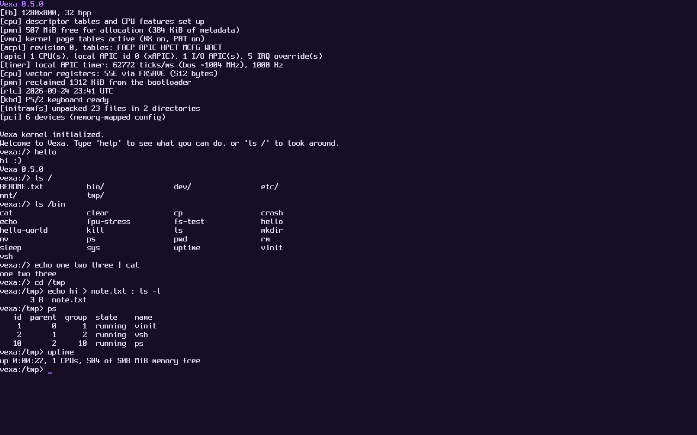

# Vexa

Vexa is a hobby operating system for x86_64, written from scratch in C.
The long-term goal is to run **Mozilla Firefox**.

Vexa has its own kernel design, its own system call interface and its own C library.
Linux programs such as Firefox run through a separate, optional compatibility subsystem
that sits on top of the Vexa kernel. See [docs/ARCHITECTURE.md](docs/ARCHITECTURE.md).



## Status

Phases 1 to 4 are complete: boot and CPU basics, memory management, processes and
user mode, and files and storage. Phase 5 is under way: Vexa now boots into its own
shell, `vsh`, with pipes and a set of core programs. The kernel:

- boots through the [Limine](https://github.com/limine-bootloader/limine) bootloader (BIOS and UEFI)
- runs in 64-bit long mode as a higher-half kernel
- shows a text console on the screen (with ANSI colors and cursor movement) and mirrors
  it to the COM1 serial port
- loads its own GDT and IDT and reports CPU exceptions with a register dump
- reads the ACPI tables and sets up the local APIC and I/O APIC, falling back to
  the legacy 8259 PIC on machines without them
- runs a 1000 Hz timer: the local APIC timer calibrated against the PIT, or the PIT
  itself
- manages memory with a buddy page allocator, its own page tables (read-only code,
  no-execute data) and a slab-based kernel heap (`kmalloc`/`kfree`)
- gives programs memory on demand, and shares pages copy-on-write
- runs on kernel stacks with guard pages, and reports stack overflows and other faults
  in plain words
- reads the PS/2 keyboard (US layout, Shift, Caps Lock, Ctrl)
- has a terminal with line editing, Ctrl-C (or Ctrl-\\) to stop programs and Ctrl-D for
  end of input
- runs threads with a preemptive scheduler, on every CPU core it finds
- runs programs in user mode, each in its own address space, and stops a program
  that misbehaves without taking the system down
- has processes with parents and children, process groups, pipes and signals
- saves and restores each program's floating point and vector registers (SSE, AVX)
- has its own system call interface and C library, `libvexa`
- has a file system tree with a root in memory (unpacked from an initramfs), `/dev`,
  and disks mounted under `/mnt`
- drives disks through virtio-blk (virtual machines), AHCI (SATA) and NVMe, reads GPT
  and MBR partition tables, and reads and writes ext2 file systems

At boot, `vinit` (the first program) starts `vsh`, the Vexa shell. Some things to try at
the `vexa:/>` prompt:

| Command | What it does |
| --- | --- |
| `hello` | says hi, and which version of Vexa is running |
| `help` | how to use the shell; `ls /bin` lists the programs |
| `ls /`, `cat /etc/motd`, `cd /tmp`, `pwd` | look around the file system |
| `echo hi > note.txt`, `mkdir`, `cp`, `mv`, `rm -r` | make, copy, move and remove files |
| `ls /bin \| cat`, `cat < note.txt`, `echo more >> note.txt` | pipes and redirection |
| `hello-world` | the first Vexa program |
| `crash` | a program that misbehaves on purpose, to show it gets stopped |
| `fs-test` | checks the file system calls |
| `fpu-stress &` | runs a program in the background (try it three times, then `ps`) |
| `sleep 30`, then Ctrl-C | stops the program in front |
| `ps`, `kill`, `uptime` | processes and how long the system has been up |
| `sys` | the kernel's own commands: `sys disks`, `sys mount`, `sys pci`, `sys cpu`, `sys mem`, `sys memtest`, `sys threads` |

The kernel's built-in command line (the kernel monitor) is still there for when
something is broken: pick it in the boot menu, and Vexa starts it instead of `vinit`.

If Vexa has trouble on a machine, pick **safe mode** in the boot menu. It ignores ACPI
and uses only the oldest, most widely supported interrupt and timer hardware. The
kernel options behind it (`acpi=off`, `noapic`) can also be set in `limine.conf`, as can
`nosmp` to use only the first CPU core.

### Disks

Vexa mounts every ext2 file system it finds at `/mnt/<disk>`, such as `/mnt/vda1`
or `/mnt/nvme0n1`. The easiest way to try it is `make run-disk`: it boots with a small
disk (kept in `build/my-disk.img`, so what you write survives restarts). To prepare
your own disk image on Linux:

```sh
truncate -s 64M disk.img && mke2fs -t ext2 disk.img
qemu-system-x86_64 -M q35 -m 512M -cdrom build/vexa.iso -boot d \
    -drive file=disk.img,if=virtio,format=raw
```

ext4 disks are refused (Vexa doesn't support their extra features yet), and ext2 has no
journal, so pulling the plug mid-write can leave the disk needing a check with
`e2fsck` on Linux.

Next in Phase 5: the Linux subsystem, starting with BusyBox. See [docs/ROADMAP.md](docs/ROADMAP.md) for the full
plan from here to Firefox.

## Download

Every push to the default branch is built and boot-tested by GitHub Actions, then
published on the [Releases page](https://github.com/EnderiumCraft/Vexa/releases):

- **[Latest build](https://github.com/EnderiumCraft/Vexa/releases/tag/latest-build)**:
  the newest ISO, replaced on every push
- **Versioned releases** (`v0.1.1`, ...): created whenever `VEXA_VERSION` in
  `kernel/include/vexa/version.h` changes, and kept permanently

Run a downloaded ISO with `qemu-system-x86_64 -M q35 -m 512M -cdrom vexa-<version>.iso`.

## Building

You need a Linux host (or WSL) with:

| Tool | Debian/Ubuntu package |
| --- | --- |
| GCC or Clang targeting x86_64 | `build-essential` |
| GNU ld | `binutils` |
| xorriso | `xorriso` |
| QEMU | `qemu-system-x86` |
| git, make | `git`, `make` |
| Python 3 (for `make test`) | `python3` |
| UEFI firmware (for `make test`) | `ovmf` |
| mke2fs and e2fsck (for test disks) | `e2fsprogs` |

```sh
make                # builds build/vexa.iso (fetches Limine on first run)
make run            # boots in QEMU; kernel log appears in your terminal
make run-disk       # the same, with a disk mounted at /mnt/vda1
make run-nographic  # headless boot, serial only (Ctrl-A then X to quit)
make test           # boots in QEMU (BIOS; UEFI with 4 CPUs and 6 GiB; safe mode), with
                    # virtio, SATA and NVMe test disks; types commands into the virtual
                    # keyboard, checks the replies, then checks the disks with e2fsck
make clean
```

## Layout

```
Makefile             build, ISO creation, QEMU and test targets
.github/workflows/   CI: build, boot-test and publish releases
limine.conf          bootloader menu entry
kernel/
  linker.ld          higher-half kernel link script
  include/limine.h   Limine boot protocol header (0BSD, vendored)
  include/vexa/      kernel headers
  src/kmain.c        kernel entry point and boot sequence
  src/arch/x86_64/   per-CPU setup, interrupts, APIC and 8259 PIC, timer, FPU state,
                     system call entry, context switch, starting other CPUs
  src/core/          memory (pmm, vmm, address spaces, heap), scheduler, processes,
                     signals, pipes, handles, VFS,
                     block cache and partitions, ELF loader, ACPI, init, kernel monitor
  src/personality/vexa/  the native Vexa system calls
  src/dev/           serial, framebuffer, text console, terminal, font, PS/2 keyboard, clock,
                     PCI, virtio-blk, AHCI, NVMe
  src/lib/           string functions, kprintf, panic
  src/fs/            ext2, tmpfs, devfs, initramfs unpacking
abi/vexa/abi.h       system call numbers and error codes, shared by kernel and libvexa
rootfs/              files for the root file system (packed into initramfs.tar)
libvexa/             Vexa's C library: program startup, system calls, printf, strings
userland/            Vexa programs, one directory each: vinit, vsh, ls, cat, ...
tests/disk-content/  files put on the test disks
tools/
  bdf2c.py           converts a BDF bitmap font into the console font table
  qemu-smoke-test.py boot test used by `make test`
  make-disk.py       builds disk images (GPT, MBR or none) holding an ext2 file system
docs/
  ARCHITECTURE.md    how the kernel, native interface and Linux subsystem fit together
  ROADMAP.md         the plan, phase by phase
```

To add a program, create `userland/<name>/main.c`: the Makefile builds every
directory there with libvexa and puts it in `/bin`, and typing `<name>` in the shell
starts it.

The console font is [Spleen](https://github.com/fcambus/spleen) 8x16 by Frederic Cambus
(BSD 2-Clause license, reproduced in `kernel/src/dev/font.c`).
