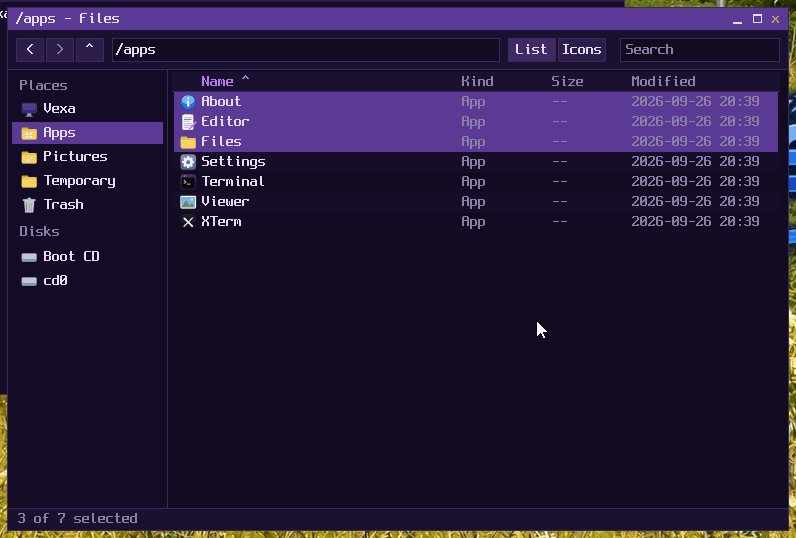

# Vexa user guide

This guide is for using Vexa: starting it, the shell and its commands, the desktop
and its apps, and the Linux programs that come with it. For building Vexa and
writing programs for it, see the [developer guide](DEVELOPER-GUIDE.md).

- [Starting Vexa](#starting-vexa)
- [Installing Vexa on a disk](#installing-vexa-on-a-disk)
- [The shell](#the-shell)
- [Commands](#commands)
- [Files and folders](#files-and-folders)
- [The desktop](#the-desktop)
- [Apps](#apps)
- [Files, the file manager](#files-the-file-manager)
- [Settings](#settings)
- [Linux programs](#linux-programs)
- [X and GTK programs](#x-and-gtk-programs)
- [Network](#network)
- [Disks and CDs](#disks-and-cds)
- [Keyboard shortcuts](#keyboard-shortcuts)
- [When something goes wrong](#when-something-goes-wrong)

## Starting Vexa

Vexa boots from a CD image (`vexa.iso`) on x86_64 PCs and virtual machines, with
BIOS or UEFI firmware. Download the newest ISO from the
[Releases page](https://github.com/EnderiumCraft/Vexa/releases) (or build it; see the
developer guide) and start it in QEMU:

```sh
qemu-system-x86_64 -M q35 -m 512M -cdrom vexa.iso
```

More memory (`-m 2G`) helps the Linux programs, and `-enable-kvm` (on a Linux host with
KVM) makes everything much faster. For a network card, add
`-netdev user,id=n0 -device virtio-net-pci,netdev=n0`; for more CPUs, `-smp 4`.

The boot menu (Limine) has these entries:

| Entry | What it's for |
| --- | --- |
| **Vexa** | the normal boot |
| **Vexa (safe mode)** | machines where the normal boot fails: ignores ACPI and uses only the oldest interrupt and timer hardware |
| **Vexa (kernel monitor)** | the kernel's own command line, instead of the normal programs, for when something is badly broken |
| **Vexa at 1024x768**, **Vexa at 1280x720** | the normal boot, with the screen at that resolution: the firmware (UEFI or VESA) is asked for it, so it works on real PCs too, where Vexa can't change the resolution later |

Other resolutions: copy one of those entries in `limine.conf` and change its
`resolution:` line (`1600x900x32`, say); if the firmware doesn't have the mode, Limine
picks one it has instead. On QEMU's and Bochs's standard VGA, Settings → Display
changes the resolution while Vexa runs, among the sizes the card can show.

The kernel options behind safe mode (`acpi=off`, `noapic`), and `nosmp` (use only the
first CPU core), can also be written into `limine.conf`.

While it starts, the kernel prints what it finds (memory, CPUs, disks, the network).
Then `vinit`, the first program, shows a welcome message and starts the shell:

```
vexa:/>
```

## Installing Vexa on a disk

From the CD (or a USB stick made from the ISO), Vexa can put itself on a disk, so the
computer starts it from there, without the CD, and keeps what you change: files,
settings, installed apps. **Everything on that disk is erased.**

- In the desktop: **Install Vexa** (in the Vexa menu, or search for it). Choose the
  disk, choose whether the Linux programs (bash, Python, X, GTK...: about 190 MB) come
  along, confirm, and wait; then take the CD out and restart.
- At the shell: `install --list` lists the disks it can use, and `install vda` installs
  on one (`--no-linux` leaves the Linux programs out; `--yes` doesn't ask first).

The disk gets a GPT partition table with two partitions: a 128 MiB FAT32 one with the
kernel and the boot menu (Limine, which starts with BIOS and UEFI firmware alike), and
the rest, ext2, for the system and your files, mounted at `/`. The boot menu has the
same entries as the CD's; they find the system by its file system's UUID
(`root=UUID=...`), so it doesn't matter which disk it is to the firmware. The disk needs
at least 512 MiB (1 GiB with the Linux programs).

In QEMU:

```sh
truncate -s 2G vexa-disk.img
qemu-system-x86_64 -M q35 -m 2G -cdrom vexa.iso -drive file=vexa-disk.img,if=virtio,format=raw
# install, then, without the CD:
qemu-system-x86_64 -M q35 -m 2G -drive file=vexa-disk.img,if=virtio,format=raw
```

Started from the disk, `/tmp` and `/run` are still emptied at each start (they're in
memory), and there's no `/cdrom`. The system's file system is ext3, with a journal:
turning the computer off in the middle of writing loses at most what was being
written, and the next start puts the file system back in order by itself.

## The shell

`vsh` is Vexa's shell. Type a command and press Enter.

| You type | What happens |
| --- | --- |
| `ls /bin` | runs a program (found in `$PATH`, or by its path) with arguments |
| `ls /bin \| cat` | a pipe: one program's output is the next one's input |
| `cat < notes.txt` | reads the input from a file |
| `echo hi > notes.txt` | writes the output to a file (`>>` adds to the end, `2>` is for errors) |
| `fpu-stress &` | runs a program in the background |
| `cd /tmp ; ls` | one command after the other |
| `echo 'a b' "c $HOME" \$` | quoting: `'...'` as is, `"..."` with `$NAME` replaced, `\` for one character |
| `echo $?` | the last command's exit code |

Built into the shell: `cd`, `exit`, `export NAME=value`, `unset NAME`, `env` and `help`.

Editing a line: Backspace, and Ctrl-U erases the whole line. Ctrl-C stops the
program in front (not the shell), Ctrl-\\ stops it harder, and Ctrl-D means "end of
input" to a program reading the keyboard.

## Commands

Vexa's own programs are in `/bin` (`ls /bin` lists them).

### Files

| Command | What it does |
| --- | --- |
| `ls [-l] [-a] [path...]` | lists folders; `-l` shows sizes, kinds and where links point, `-a` names starting with a dot |
| `cat [file...]` | shows files (or the input) |
| `cp [-r] from to`, `cp [-r] file... folder` | copies files; `-r` copies folders with everything in them |
| `mv from to`, `mv path... folder` | renames or moves |
| `rm [-r] path...` | removes files and empty folders; `-r` removes folders with everything in them |
| `mkdir [-p] path...` | makes folders; `-p` makes missing parents too |
| `ln -s target name` | makes a symbolic link |
| `pwd` | the current folder |
| `open file`, `open -a App [file]` | opens something as a double click would (see [Apps](#apps)) |

### Processes and the system

| Command | What it does |
| --- | --- |
| `ps` | the running processes |
| `kill [-signal] id...` | sends a signal (`kill -9 12`); SIGTERM unless told |
| `sleep seconds` | waits (fractions allowed: `sleep 0.5`) |
| `uptime` | time since boot, CPUs and memory |
| `hello` | says hi, with Vexa's version |
| `hostname [name]` | the computer's name; sets it with a name |
| `df` | the mounted file systems, and how full they are |
| `devices [-l] [kind]` | the devices Vexa found, as a tree, with their drivers; `-l` adds ids, places and details; a kind or bus shows only those: `devices usb`, `devices disk`, `devices keyboard` |
| `shutdown`, `shutdown -r` | turns the machine off (ACPI), or restarts it |
| `clear` | clears the screen |
| `sys [command]` | the kernel monitor's commands: `sys disks`, `sys mount`, `sys pci`, `sys cpu`, `sys mem`, `sys memmap`, `sys memtest`, `sys threads`; `sys` alone lists them |

### Network

| Command | What it does |
| --- | --- |
| `net` | network interfaces, their addresses and traffic |
| `fetch [-o file] http://host/path` | downloads a web page (HTTP) and shows it, or saves it with `-o` |

### Graphics and input

| Command | What it does |
| --- | --- |
| `desktop` | starts the desktop (see [The desktop](#the-desktop)) |
| `input`, `input watch N [count]` | lists keyboards and mice; shows what one reports |
| `notify text` | shows a notification on the desktop |
| `term`, `files`, `edit [file]`, `view image`, `settings`, `about` | the desktop's apps, from a terminal on the desktop |

### Checks

These check that parts of Vexa work, and print what they find:

| Command | What it checks |
| --- | --- |
| `hello-world` | the very first Vexa program: user mode and system calls |
| `crash` | misbehaves on purpose: Vexa must stop it and carry on |
| `fs-test` | the file system calls (in `/tmp`, and on a disk at `/mnt/vda1` if there is one) |
| `fpu-stress` | that each program's vector registers survive; run several with `&` |
| `thread-test [exit]` | threads, a mutex and waits |
| `posix-test [-v]` | the POSIX layer: files, `printf` and `scanf` with floats, math, pthreads, time |
| `socket-test` | sockets over the loopback network |

## Files and folders

Vexa's file system starts in memory and has these folders:

| Folder | What's in it |
| --- | --- |
| `/bin` | Vexa's programs (the apps' programs are links into their bundles) |
| `/lib` | `libvexa.so` and Vexa's dynamic loader, `vexa-ld.so` |
| `/apps` | the desktop's apps, as `.vxapp` bundles |
| `/home` | your folders: `Desktop` (its files are the desktop's icons), `Documents`, `Pictures` (screenshots go here) |
| `/etc` | settings: `motd`, `desktop.conf`, `hosts`, `resolv.conf` |
| `/share/pictures` | pictures (the default wallpaper, `aurora.png`, and `meadow.png`) |
| `/share/fonts` | the fonts Vexa's apps draw text with (DejaVu Sans, Sans Bold, Sans Mono) |
| `/tmp` | scratch space |
| `/Trash` | what Files moved to the Trash |
| `/dev` | devices: the console, terminals (`/dev/pts`), `/dev/input`, `/dev/display0`, `/dev/dri/card0` (for Linux programs), `/dev/random` |
| `/proc` | the processes and the system, in Linux's format (`cat /proc/meminfo`) |
| `/run` | the desktop's socket and shared window buffers |
| `/mnt` | disks and CDs (`/mnt/vda1`, `/mnt/cd0`, ...) |
| `/cdrom` | the boot CD |
| `/linux` | the Linux programs' own file tree (`/linux/usr/bin`, ...) |

Everything outside `/mnt` is in memory: it starts fresh at every boot. To keep files,
put them on a disk (see [Disks and CDs](#disks-and-cds)). When Vexa has a disk it can
write to (the first writable ext2 disk), `/home` is kept on it (as `home` there), so
the Desktop, Documents and Pictures folders stay from one boot to the next.

## The desktop

Type `desktop` at the shell. The desktop takes the screen and opens a terminal window.
Ctrl+Alt+Q (it asks first) goes back to the text console.


**The panel** along the top has:

- the **Vexa menu** (top left): the apps, then the Linux programs, then Lock Screen,
  Restart..., Shut Down... and Back to the console...; each shows its keyboard shortcut
- a **button for each window**: a click shows it (or minimizes it, if it's in front)
- the **magnifier**: search (below)
- the **clock**: a click opens the **calendar** (the arrows go to other months; the
  month's name comes back to this one) and the **notifications** seen lately, newest
  first, which Clear takes away. A dot by the clock means there are new ones.

**Desktop icons.** On the left: the apps (Terminal, Files, Editor, Settings, XTerm),
then whatever is in the **Desktop folder** (`/home/Desktop`), as on a Mac; the **Trash**
is in the bottom right corner. A click selects an icon (Ctrl+click adds to the
selection; dragging over the desktop selects all the icons it covers), a double click
opens it. Drag files' icons to move them on the desktop (they stay where they're put),
onto a folder's icon or the Trash, or into a Files window. Files dragged out of a
Files window onto the desktop go into the Desktop folder (hold Ctrl to copy rather
than move). A **right click** on the desktop opens a menu (New Terminal, Open Files,
New Folder, Change Wallpaper, About Vexa); on an icon, Open, Show in Files and Move to
Trash; on the Trash, Open and Empty Trash.

**Windows**

- drag a window by its **title bar**; a click raises it and gives it the keyboard
- the buttons on the right of the title bar **minimize**, **maximize** and **close** it
  (they light up under the pointer); a double click on the title bar maximizes it
- drag the **left, right or bottom edge** (or a bottom corner) to resize it: the
  pointer changes over them
- drag a window to the **top edge** of the screen to maximize it, to the **left or right
  edge** to fill that half, or into a **corner** for a quarter; a see-through outline
  shows where it will go. Dragging a maximized or snapped window brings back its old size
- **Super+arrows** do the same from the keyboard: Super+Left or Right a half, then
  Super+Up or Down a quarter (or maximize, or minimize), and the opposite arrow back
- **Alt+Tab** shows a picture of each window, the most recently used first: hold Alt
  and press Tab (Shift+Tab goes back), and let go of Alt to bring that one to the front
- **Alt+F4** closes the window in front; **Super+D** minimizes everything (again: back)
- windows have soft **shadows**; they grow in when they open, fade when they close and
  fly to their panel button when minimized (Settings, Desktop & Panel, can turn the
  animations off)

**Search** (Ctrl+Space or Super+Space, or the magnifier on the panel): type, and it
finds apps, Settings' sections (by name or by what's in them: "password", "resolution")
and files (in `/home`, `/share`, `/tmp` and the disks). It also does sums: `12*(3+4)`
shows 84. Up and Down choose, Enter opens, Escape closes.

**Screenshots**: PrintScreen takes the whole screen, Alt+PrintScreen the window in
front, and Shift+PrintScreen an area (drag over it; Escape cancels). They're saved in
`/home/Pictures` as PNG files ("Screenshot 2026-10-02 at 20.45.13.png"), and a
notification says so.

**The lock screen and the screensaver.** Super+L (or Ctrl+Alt+L, or Lock Screen in the
Vexa menu) locks the screen: the time and date over the blurred wallpaper, and the
password field if a password is set (Settings, Lock Screen); without one, any key or
click unlocks. After some minutes without the keyboard or the mouse (10, unless
Settings says otherwise), the screensaver starts: the time drifting slowly over the
dark, blurred wallpaper. Any key or movement wakes it, to the lock screen if Settings
says so.

**Notifications** appear at the top right for a few seconds (`notify Hello!` shows one);
the clock keeps them for later.

**Text** in Vexa's own apps is drawn smooth, with TrueType fonts (DejaVu), and can be
any language's letters: with a German, French or Spanish layout, ü, é, ñ and € type as
they should.

## Apps

The desktop's apps are **bundles**, as on macOS: an app is a folder whose name ends
in `.vxapp`, kept in `/apps`. Files shows each one as a single app with its icon.

| App | Bundle | What it is |
| --- | --- | --- |
| Terminal | `Terminal.vxapp` | a terminal window running the shell |
| Files | `Files.vxapp` | the file manager |
| Text Editor | `Editor.vxapp` | a text editor; opens any file |
| Image Viewer | `Viewer.vxapp` | shows PNG, BMP and PPM pictures |
| Settings | `Settings.vxapp` | System Settings: the look, wallpaper, clock, mouse and keyboard, display, lock screen... |
| About Vexa | `About.vxapp` | the version, and how the system is doing |
| Activity Monitor | `Monitor.vxapp` | the processes, CPU and memory; Quit and Force Quit |
| Calculator | `Calculator.vxapp` | a calculator |
| Calendar | `Calendar.vxapp` | a month at a time, with your events |
| Notes | `Notes.vxapp` | notes, saved as you type |
| Paint | `Paint.vxapp` | drawing and painting; opens and saves PNG |
| Help | `Help.vxapp` | this guide, with its contents and search |
| XTerm | `XTerm.vxapp` | an xterm (a Linux X program; only when the Linux files are there) |

**Opening things.** `open` does what a double click in Files does:

```sh
open /share/pictures/aurora.png   # with the app for .png files: Image Viewer
open /tmp                         # a folder: in Files
open /apps/Settings.vxapp         # starts the app
open -a Editor notes.txt          # with a given app (its name or bundle name)
open -a Terminal                  # just starts it
```

**Installing an app** is copying its bundle into `/apps` (with Files, or
`cp -r MyApp.vxapp /apps/`). Within a couple of seconds the desktop adds it to the
menu (and, if it asks for one, a desktop icon). Removing the bundle uninstalls it.

What's inside a bundle, and how to make one, is in the developer guide.

### Terminal

A terminal window running `vsh` on a pseudo-terminal. It shows 16, 256 and 24-bit
colours and moves the cursor the way the console does, so full-screen programs like
`vi`, `less` and `top` (from BusyBox) work. It can be resized; the program inside is
told its new size.

| Keys | What they do |
| --- | --- |
| Ctrl+Shift+T, Ctrl+Shift+W | a new tab (each its own shell), close the tab |
| Ctrl+PageUp, Ctrl+PageDown, Ctrl+Tab | the previous, next tab (or click it; + opens one) |
| Shift+PageUp, Shift+PageDown, the wheel | scroll back through what went by (800 lines; a scroll bar shows) |
| dragging, a double click | select (a double click: a word); selecting copies |
| Ctrl+Shift+C, Ctrl+Shift+V, the middle button | copy, paste |
| Ctrl+=, Ctrl+-, Ctrl+0 | bigger, smaller, the usual size |

A right click opens a menu with the same.

### Text Editor

`edit [file...]` opens files (or a new one), each in a tab. C (and C-like languages),
Python, shell scripts, Markdown and settings files are coloured.

| Keys | What they do |
| --- | --- |
| arrows, Home, End, Page Up, Page Down, a click | move (Home: to the first letter, then the line's start) |
| Shift with those, or dragging | select |
| Ctrl+Z, Ctrl+Y (or Ctrl+Shift+Z) | undo, redo |
| Ctrl+X, Ctrl+C, Ctrl+V, Ctrl+A | cut, copy, paste (the clipboard every app shares), select all |
| Ctrl+F, Ctrl+H, F3 (Shift+F3) | find, replace (Next, Replace, All), find the next (the one before) |
| Ctrl+N, Ctrl+O, Ctrl+S, Ctrl+Shift+S | new tab, open, save (asking for a name the first time), save as |
| Ctrl+W, Ctrl+Tab, Ctrl+Q | close the tab, the next tab, quit |

Files dropped on the window open in tabs.

### Image Viewer

`view [file]` shows a PNG (8 bits per channel, not interlaced), BMP (24 or 32 bits) or
PPM (P6) picture, fitted to the window. The toolbar, or the keys: Left and Right (or
Page Up and Page Down) the previous and next picture in the folder; `+`, `-` or the
wheel zoom, `0` fits, `1` is actual size; dragging (or the arrows, when zoomed) moves
it; `R` turns it right, Shift+R left; Space or `S` starts a slideshow (a picture every
three seconds; any key stops it); Ctrl+O opens another.

### About Vexa

The version, the number of CPUs, memory in use, time since boot, the number of
processes and the network address, updated every second.

### Activity Monitor

Every process with its CPU use (over the last second), memory and threads, updated
every second; a click on a column sorts by it. Below, CPU and memory over the last
minute. Select a process and **Quit** asks it to stop (SIGTERM; Delete does the same),
**Force Quit** stops it (SIGKILL).

### Install Vexa

Puts Vexa on a disk (see [Installing Vexa on a disk](#installing-vexa-on-a-disk)): the
disks, the Linux programs or not, a last warning that the disk will be erased, and the
install's steps as it goes. It only installs when Vexa was started from the CD.

### Device Manager

Every device Vexa found and which driver has it: processors, the display, disks and
their controllers, keyboards, mice and tablets, sound, network, USB controllers, hubs
and devices. **By type** groups them (a click on a group's heading folds it away);
**By connection** shows what's connected to what: a USB mouse on a hub, on a port of
the USB controller, on the PCI bus (Tab switches between the two). Choose a device to
see its driver, where it's connected, its vendor and device ids and details (a disk's
size and where it's mounted, a USB device's speed). Devices Vexa has no driver for are
shown in orange. It follows along as USB devices are plugged in and out.

### Doom

The 1993 game, as Chocolate Doom (a faithful port of id Software's released source,
here built for Vexa with SDL), with **Freedoom: Phase 1**, a free set of levels, art,
sounds and music made to replace the original's. Its music is played on an emulated
OPL2 FM synthesizer, like a 1990s Sound Blaster.

Arrow keys move, Ctrl fires, Space opens doors, Shift runs, 1 to 7 choose a weapon,
Tab shows the map and Escape the menu (where Options sets the mouse, the sound and the
keys). Its settings and saved games are kept in `/home/.local/share/chocolate-doom`.

It also plays other Doom WAD files: `chocolate-doom -iwad /path/to/doom2.wad` at a
terminal (with your own copy of Doom or Doom II, say), and `-file` adds levels made for
them. `chocolate-doom -timedemo demo1` plays the first demo as fast as it can and says
how many frames a second that was.

### Calculator

Click the buttons or type: digits, `+ - * /`, `%`, Enter or `=`, Backspace, Escape
to clear. Ctrl+C copies the answer, Ctrl+V pastes a number.

### Calendar

A month, with today marked and the day's events in it. A click picks a day; its
events are on the right, where you add one (type it, with a time first if you like:
"09:30 Dentist", and press Enter) or take one away (its x). The arrows (or Page Up and
Page Down, or the wheel) go to other months, Today comes back. Events are kept in
`/home/.calendar`.

### Notes

Your notes on the left, the newest first, each named by its first line; the one you
chose on the right, wrapped to the window. Notes are saved as you type, as text files
in `/home/Notes`. Ctrl+N (or +) makes one, Ctrl+Delete deletes it, and the search field
finds notes by what's in them.

### Paint

A picture to draw on: Pencil, Brush, Line, Rectangle (Shift: a square), Ellipse, Fill,
Eraser and Pick (a colour from the picture), four sizes and sixteen colours; a right
click draws with the second colour (the square behind the first; a click on them swaps
them). Ctrl+Z and Ctrl+Y undo and redo; New, Open and Save (Ctrl+N, O, S) use PNG files
(BMP and PPM open too). `paint [file]` opens one.

### Help

This guide, set out to read: the contents on the left, search at the top (type, then
Enter for the next place it's found).

### Open and Save

Apps that open and save files (Text Editor, Paint, Image Viewer) share the same dialog:
places on the left (Home, Desktop, Documents, Pictures, Wallpapers, Vexa, Temporary),
the folder's contents, and for saving a name. A double click opens a folder or chooses
a file; Enter chooses; Backspace goes up; Escape cancels.

### The clipboard

Text copied in one app pastes in any other: the Terminal, the Text Editor, Notes, the
Calculator, and X programs too (xterm, GTK programs), both ways.

## Files, the file manager

Files works much like Finder on macOS. Start it from the menu, its desktop icon,
Ctrl+Alt+F, or `files [folder]`.



**The window**

- the **sidebar**: Places (Vexa, the whole system; Apps; Pictures; Temporary; Trash)
  and Disks (the boot CD, and disks in `/mnt`)
- the **toolbar**: Back and Forward (`<`, `>`), Up (`^`), the location (click it, or
  Ctrl+L, to type one), **List** and **Icons**, and **Search**
- the **folder**, as a list (Name, Kind, Size, Modified: click a heading to sort by it,
  again to reverse) or as icons, where pictures show as thumbnails
- the **status bar**: how many items, how many are selected, or what just happened

**Selecting.** A click selects one thing; Ctrl-click adds or takes away; Shift-click
selects everything in between; Ctrl+A selects all; Esc, or a click on nothing, selects
nothing. The arrow keys move (with Shift, they extend the selection). Typing the first
letters of a name goes to it.

**Opening.** A double click or Enter opens: a folder goes into it, an app starts, a
program in `/bin` runs, and a file opens with the app for its type (pictures in Image
Viewer, anything else in the Text Editor). Backspace (or Alt+Up) goes up; Alt+Left and
Alt+Right go back and forward.

**Quick Look.** Space shows the selected picture or text file in a panel over the
window, without opening an app; Space or Esc closes it.

**Search.** Ctrl+F (or a click in the search field) and type: the folder shows only what
has that in its name. Enter keeps the search; Esc clears it.

**Changing things.** A right click opens a menu with everything you can do; so does the
keyboard:

| Action | Keys | What it does |
| --- | --- | --- |
| Copy, Cut | Ctrl+C, Ctrl+X | puts the selection on the clipboard (shared by all Files windows) |
| Paste | Ctrl+V | copies (or moves, after Cut) it here; a name that's taken gets a number ("notes 2.txt") |
| Duplicate | Ctrl+D | a copy next to the original |
| Make Alias | (menu) | a symbolic link to it ("name alias") |
| Rename | F2 | type the new name, Enter (Esc keeps the old one) |
| New Folder | Ctrl+Shift+N | "untitled folder", named right away |
| New Text Document | (menu) | an empty "untitled.txt", named right away |
| Move to Trash | Delete | moves it to `/Trash` |
| Delete Immediately | Delete, in the Trash | removes it for good (asks first) |
| Empty Trash | (menu, in the Trash) | removes everything in the Trash (asks first) |
| Get Info | Ctrl+I | kind, size (a folder's files counted), where, when modified, where an alias points, an app's program and file types, the app a file opens with |
| Show Package Contents | (menu, on an app) | opens the bundle as a folder |
| Open in Text Editor | (menu, on a file) | opens any file as text |
| Open in Terminal | (menu, on nothing) | a terminal in this folder |
| Show Hidden Files | Ctrl+H | shows (or hides) names starting with a dot |
| List, Icons | Ctrl+1, Ctrl+2 | the two views |

**Dragging.** Drag the selection onto a folder in the list, or onto a place in the
sidebar, to move it there; hold Ctrl to copy instead. Dropping onto Trash moves it to the
Trash.

## Settings

Settings (in the Vexa menu, or a right click on the desktop, "Change Wallpaper...")
works like System Settings on macOS: the sections are in the sidebar, the search field
above them finds a setting by name ("clock", "double click"; typing anywhere starts a
search), and every change applies as it's made: the desktop and every open app follow
at once. `settings Display` opens a section directly.

| Section | What's there |
| --- | --- |
| **Appearance** | Dark or Light, and the accent color (Purple, Blue, Teal, Green, Orange, Pink, Red, Graphite): the panel, menus, title bars and Vexa's apps follow; the terminal stays dark |
| **Wallpaper** | the pictures in `/share/pictures` (as thumbnails), five gradients, how a picture fits (Fill, Fit, Center, Tile, Stretch), and any other PNG, BMP or PPM file by its path |
| **Desktop & Panel** | desktop icons on or off, and which apps have one; the clock (24 or 12 hours, the weekday, the date, seconds); snapping windows to the edges; animations; what a double click on a title bar does (maximize, minimize, nothing); how long notifications stay |
| **Date & Time** | the time now, and the time zone: a city (54 of them) from a list, with summer time handled by itself (the European, North American, Australian and New Zealand rules) |
| **Mouse & Keyboard** | pointer speed, double click speed (with a place to try it), natural scrolling, left-handed buttons; the keyboard layout (US, UK, German, French, Spanish, Dvorak), how soon and how fast a held key repeats; the keyboard shortcuts |
| **Lock Screen** | when the screensaver starts (never, or after 1 to 30 minutes), whether the lock screen comes when it ends, the password (or none), and a button to lock now |
| **Display** | the resolution (a list of sizes, on QEMU's and Bochs's standard VGA; elsewhere the firmware's size) and the scale (everything twice as big); after a change, "Keep" it, or it goes back by itself in 15 seconds |
| **Default Apps** | which app opens each kind of file (`.png`, `.txt`, `.c`...) |
| **Startup** | whether a terminal opens when the desktop starts, and which apps open with it |
| **Network** | the computer's name (Linux programs see it too), and each interface's address, router, DNS server, hardware address and traffic |
| **Storage** | each disk and file system with how full it is, and where settings are kept |
| **About** | the version, the computer's name, CPUs, memory, time since boot, the display, and Restart and Shut Down |

**Where settings live.** In plain text files in `/etc`: `desktop.conf` (most of them),
`apps.conf` (default apps) and `hostname`:

```
theme=light
accent=blue
wallpaper=image
wallpaper_image=/share/pictures/aurora.png
wallpaper_mode=fill
time_zone=Berlin
clock=24
pointer_speed=5
keyboard_layout=de
display_width=1920
display_height=1080
```

`/etc` is in memory, so when Vexa has a disk it can write to (the first writable ext2
disk), Settings also keeps a copy there, in `.vexa/etc`, and Vexa puts them back when
it starts. Without a disk, settings last until Vexa restarts. Storage says which.

**Keyboard layouts.** Vexa's own apps type every character of the layout, AltGr's too
(€, @, { on a German keyboard), and the accent keys work as they do there: ^ then e
types ê, ´ then a types á (the accent twice, or then Space, types it alone). X programs
get the whole layout, through XKB. The text console (outside the desktop) stays US.

**The lock screen's password** is kept in `desktop.conf` as a hash (`lock_password`),
not as itself. It's there to keep someone at the keyboard out, not someone who can
read your disk.

**Restarting and turning off.** The Vexa menu has **Restart...** and **Shut Down...**
(each asks first), and so does About; from the shell, `shutdown` and `shutdown -r`.

## Linux programs

Vexa runs Linux programs (built for x86_64 Linux, with the musl C library) through
its Linux subsystem. They keep their own file tree under `/linux`, and look there
first: `/linux/usr/bin/bash` is what a Linux program sees as `/usr/bin/bash`. From
`vsh`, their names work like Vexa's:

| Program | What it is |
| --- | --- |
| `bash` | GNU bash 5.2 (`exit` goes back to `vsh`) |
| `busybox`, `sh` | BusyBox 1.36: `vi`, `less`, `grep`, `sed`, `awk`, `find`, `top`, `ps`, `wget`, `ping`, `ifconfig`, `tar`, and about 300 more (`busybox` lists them) |
| GNU coreutils 9.4 | `ls`, `cp`, `sort`, `df`, `timeout`, ... (inside bash, `ls` is coreutils') |
| `python3` | Python 3.12, with threads, `subprocess`, `multiprocessing`, sockets, `urllib`, `asyncio`, `ssl`, `hashlib` |
| `curl`, `openssl` | curl 8.5 and OpenSSL 3.0: HTTPS (and FTP, SMTP and more) with the standard root certificates |
| `xterm`, `gtk3-demo`, ... | X and GTK programs (see below) |

They get the usual Linux interfaces: processes (`fork`, `exec`), signals, threads,
pipes, terminals, sockets (TCP, UDP, local sockets that pass open files), shared memory
and `/proc`, and Linux's graphics and input interfaces: DRM on `/dev/dri/card0` (kernel
modesetting with "dumb buffers": a program can show pictures on the whole screen, taking
it from the console while it does, though not while the desktop has it) and evdev on
`/dev/input/event*`. `pthread-test`, `bsd-socket-test`, `memfd-test`,
`python-net-test.py` and `drm-test` check parts of it.

## X and GTK programs

X programs run on Vexa's desktop through **Xvexa**, Vexa's X server: each X window
becomes a desktop window of its own, which you move, resize, maximize and close like
any other. Ctrl+Alt+X (or the XTerm icon) opens an xterm, with DejaVu fonts.

From a terminal, `xrun program` starts any X program (and the X server, the first
time):

```sh
/linux/usr/bin/xrun xterm
/linux/usr/bin/xrun gtk3-demo
```

GTK 3 programs appear in the Vexa menu (from the `.desktop` files in
`/linux/usr/share/applications`): **GTK 3 Demo**, **GTK 3 Widget Factory** and **GTK 3
Icon Browser**. GTK windows draw their own title bars; their buttons (minimize,
maximize, close) and dragging work through Xvexa, which stands in for a window manager.

### OpenGL

Linux programs have OpenGL (4.5, and OpenGL ES) through Mesa's **llvmpipe**, which
draws on the processor: LLVM compiles the shaders to machine code, using every core.
X programs use it through GLX (`libGL`), in their windows on the desktop; programs that
draw into memory use OSMesa, without X. `gl-test` draws a triangle with a shader and
checks the result (`xrun gl-test x` does it in an X window). It isn't fast, but it's
enough for programs that need OpenGL to run.

## Sound

With an HD Audio sound card (the kind in most PCs, and QEMU's `intel-hda`; `make run`
adds one), Vexa plays sound through `/dev/audio0`:

```sh
play --tone 440 3        # a 440 Hz tone for three seconds
play music.wav           # a WAV file (16-bit, 44100 or 48000 Hz, mono or stereo)
```

Linux programs play through ALSA, as on Linux: `aplay file.wav` and `speaker-test -t
sine` work, and so do programs built with alsa-lib (its "default" device converts
whatever they play to what the card takes). There's no recording, mixer or volume
control yet; the volume is the card's.

## D-Bus

X programs get a D-Bus session bus, started with the X server (`xrun` sets
`DBUS_SESSION_BUS_ADDRESS`), for the programs that need one to talk to each other.
`dbus-send` and `dbus-monitor` are there to look at it.

## Network

Vexa drives these wired network cards: virtio-net (QEMU's and other virtual
machines'), **Intel** PRO/1000 cards (e1000 and e1000e: 82540 to 82574, and the I217,
I218 and I219 built into many PCs' boards) and **Realtek** RTL8139 and RTL8111/8168
(also very common on boards). The cards are `eth0`, `eth1`... in the order they're
found; `net` and Device Manager list them. Wi-Fi isn't supported yet. In QEMU,
`-device e1000,netdev=n0`, `e1000e` and `rtl8139` try the other drivers.

With a network card (QEMU's `virtio-net-pci`), Vexa gets an address by DHCP when it
starts. In QEMU's user-mode network: Vexa is 10.0.2.15, the router (and your machine)
is 10.0.2.2, and DNS goes through 10.0.2.3.

```sh
net                           # interfaces and addresses
fetch http://example.com/     # a web page (Vexa's program)
wget -O - http://example.com/ # the same, with BusyBox
ping -c 3 10.0.2.2            # BusyBox's ping
python3 -c "import urllib.request; print(urllib.request.urlopen('http://example.com').status)"
```

HTTPS works in Linux programs: `curl` and `openssl` (OpenSSL 3.0), and Python's `ssl`
module (so `urllib` opens `https://` addresses). They check servers' certificates
against the standard root certificates, Mozilla's, in `/etc/ssl/certs/ca-certificates.crt`.

```sh
curl https://example.com/                        # a web page over HTTPS
curl -sI https://www.python.org/ | head -1       # just the answer's first line
openssl s_client -connect example.com:443 </dev/null | head  # the certificate chain
python3 -c "import urllib.request; print(urllib.request.urlopen('https://example.com').status)"
```

Vexa's own `fetch` and BusyBox's `wget` still speak only HTTP. There's no IPv6 yet.

## Disks and CDs

Vexa mounts every ext2 file system and CD it finds at `/mnt/<disk>`: `/mnt/vda1` (a
virtio disk's first partition), `/mnt/sda1` (SATA), `/mnt/nvme0n1` (NVMe), `/mnt/cd0`
(a CD). The boot CD is also `/cdrom`. `sys disks` lists the disks and partitions, and
`sys mount` what's mounted. Files shows them in its sidebar, under Disks.

It drives virtio-blk, AHCI (SATA disks and CD/DVD drives), NVMe and IDE (older PCs'
disks and CD drives as `hda`, `hdb`... and `cd0`, and VirtualBox's CD drive as it comes),
reads GPT and MBR
partition tables, reads and writes **ext2** and **ext3** (ext2 with a journal; disks
made with `mke2fs -t ext3` on Linux work, and Linux reads what Vexa writes), and reads CDs
(ISO 9660 with Rock Ridge). On ext3, each change is written to the journal first, so
turning the machine off in the middle of writing can't leave the disk inconsistent: the
next mount (Vexa's, or Linux's) finishes or forgets the last change. ext2 has no journal,
and may need `e2fsck` (on Linux) after that. ext4 disks are refused (their extra
features, such as extents, aren't supported yet).

A disk to try, on Linux:

```sh
truncate -s 64M disk.img && mke2fs -t ext2 disk.img
qemu-system-x86_64 -M q35 -m 512M -cdrom vexa.iso -drive file=disk.img,if=virtio,format=raw
```

Then `ls /mnt/vda` (a disk that's one file system, without partitions, is mounted as
itself), and what you save there is still there next time.

## USB

Vexa drives USB controllers and what's plugged into them, through hubs too:
**xHCI** (USB 1, 2 and 3, what PCs have had since about 2012), and the older ones:
**EHCI** (USB 2) with its USB 1 companions, **UHCI** (Intel's and VIA's) and **OHCI**
(AMD's, SiS's, NVIDIA's and others'). On those older PCs, USB 2 devices go through EHCI
and keyboards, mice and other USB 1 devices through the companion controller on the
same port; Vexa hands them over by itself.

- **Keyboards and mice** work as soon as they're plugged in, next to the PS/2 ones, in
  the desktop and at the text console. **Tablets** (and QEMU's USB tablet, which `make
  run` adds so the pointer follows the host's) move the pointer to where they point.
- **USB sticks and disks** appear as `usb0`, `usb1`... and are mounted at `/mnt/usb0`
  (or `/mnt/usb0p1` for a partition), in Files' sidebar too. Writes go straight to the
  stick, so it can be pulled out once a copy has finished; files left open on it stop
  working.
- The desktop says what was connected (and where a stick is) and what was
  disconnected. `devices usb` and Device Manager show what's plugged in and where.

Other kinds of USB devices (printers, cameras, sound, network adapters) are listed,
without a driver yet.

The older controllers have no MSI interrupts, so Vexa checks on them every few
milliseconds instead (a tiny amount of work).

In QEMU: `-device qemu-xhci,id=xhci -device usb-kbd,bus=xhci.0 -device
usb-mouse,bus=xhci.0`, and a stick: `-drive if=none,id=stick,file=stick.img,format=raw
-device usb-storage,bus=xhci.0,drive=stick`. QEMU's monitor (Ctrl+Alt+2) plugs them in
and out while Vexa runs: `device_add usb-storage,bus=xhci.0,drive=stick,id=s` and
`device_del s`. The older controllers: `-device usb-ehci,id=xhci` (USB 2 alone),
`-device piix3-usb-uhci,id=xhci` or `-device pci-ohci,id=xhci` in place of
`qemu-xhci` (keeping the name, so the rest stays the same).

## Keyboard shortcuts

**Console and terminals**: Ctrl-C stop the program, Ctrl-\\ stop it harder, Ctrl-D end of
input, Ctrl-U erase the line.

**Desktop**

| Keys | What they do |
| --- | --- |
| Ctrl+Alt+T | a new terminal |
| Ctrl+Alt+F | Files |
| Ctrl+Alt+E | the text editor |
| Ctrl+Alt+X | an xterm |
| Alt+Tab, Alt+Shift+Tab | switch windows (with pictures of them, while Alt is held) |
| Alt+F4 | close the window in front |
| Super+Left, Right, Up, Down | snap to a half or a quarter, maximize, back (or minimize) |
| Super+D | show the desktop (minimize everything; again: back) |
| Ctrl+Space, Super+Space | search |
| Super+L, Ctrl+Alt+L | lock the screen |
| PrintScreen | a screenshot (Alt: the window in front; Shift: an area) |
| Ctrl+Alt+Q | back to the text console (it asks first: Enter) |
| Esc | closes the Vexa menu, the calendar, a menu or search |

**Files**: Enter open, Space Quick Look, Backspace or Alt+Up up, Alt+Left back,
Alt+Right forward, Ctrl+C copy, Ctrl+X cut, Ctrl+V paste, Ctrl+D duplicate, F2 rename,
Delete move to Trash, Ctrl+I Get Info, Ctrl+A select all, Ctrl+F search, Ctrl+L type a
location, Ctrl+H hidden files, Ctrl+1 list, Ctrl+2 icons, Ctrl+Shift+N new folder, Esc
select nothing.

**Terminal**: Ctrl+Shift+T new tab, Ctrl+Shift+W close it, Ctrl+Shift+C copy,
Ctrl+Shift+V paste, Shift+PageUp scroll back, Ctrl+= and Ctrl+- the size.

**Text Editor**: Ctrl+Z undo, Ctrl+Y redo, Ctrl+F find, Ctrl+H replace, Ctrl+O open,
Ctrl+S save, Ctrl+N new tab, Ctrl+W close it, Ctrl+Q quit.

**Image Viewer**: Left and Right the previous and next picture, `+` and `-` zoom, `0`
fit, `R` turn, Space slideshow.

## When something goes wrong

- **A program misbehaves**: Vexa stops it and prints why (a page fault, say, with the
  address), and everything else carries on. Ctrl-C stops a program that doesn't
  end.
- **The desktop stops responding**: Ctrl+Alt+Q, then Enter, goes back to the console,
  if the desktop still reads the keyboard.
- **Vexa doesn't boot on a machine**: try **safe mode** from the boot menu, then add
  `nosmp` in `limine.conf`.
- **Something is badly broken**: the **kernel monitor** entry in the boot menu starts
  the kernel's own command line (`help` lists its commands), without any programs.
- **The kernel stops** ("VEXA KERNEL PANIC"): the screen (and the serial port) show
  the reason and the CPU's registers. Please report it, with that text, on the
  [issues page](https://github.com/EnderiumCraft/Vexa/issues).
